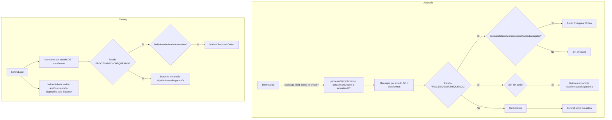
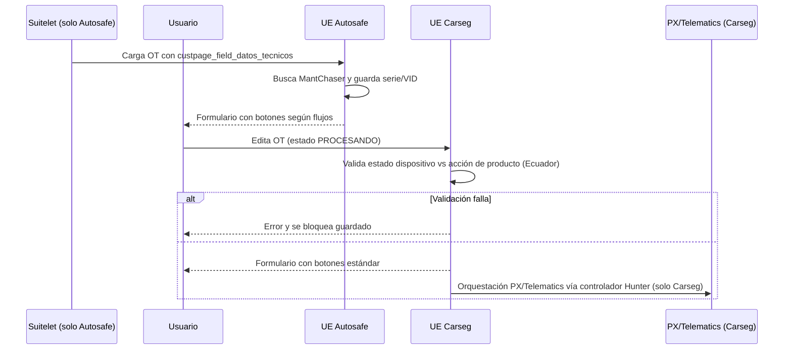

# Comparativo Autosafe vs Carseg

## Panorámica
- **Autosafe** y **Carseg** comparten los módulos de constantes, controlador de negocio y mensajes de error; las diferencias reales viven en el User Event de Orden de Trabajo y en un controlador adicional de Carseg para integraciones PX/Telematics.
- Ambos User Events ejecutan la misma lógica de **afterSubmit** (orquestación de coberturas, fulfilment, integraciones) porque comparten el controlador; las variaciones aparecen antes de esa fase (pre-carga y validaciones).

## Resumen rápido de diferencias
| Área | Autosafe | Carseg |
| --- | --- | --- |
| Pre-ensamble desde Suitelet | Procesa `custpage_field_datos_tecnicos`, busca el MantChaser, rellena serie, dispositivo y VID en la OT y muestra mensajes de éxito/advertencia.| No procesa parámetros externos; la OT se carga sin modificaciones automáticas. |
| Botones en **beforeLoad** | Ensamble (alquiler/custodia/garantía) solo si **no** hay serie; "Chequear Orden" también considera flujos de custodia o alquiler. Client script `TS_CS_Ensamble_Dispositivo_PE.js`. | Siempre crea los tres botones de ensamble (vista y edición) y el chequeo depende solo de serie/instalaciones/accesorios. Client script base `TS_CS_Ensamble_Dispositivo.js`. |
| Validación en **beforeSubmit** | No valida estado de dispositivo. | En subsidiaria Ecuador, bloquea guardar si el estado del dispositivo no es compatible con la acción de producto o la entrega directa. |
| Integraciones Hunter | No existe módulo. | Controlador `HU_TS_ScriptPlataformas_controller.js` envía a PX/Telematics y registra resultados. |

## User Event de Orden de Trabajo
### beforeLoad
- **Autosafe**: si el Suitelet envía `custpage_field_datos_tecnicos`, ejecuta `procesarDatosTecnicos` que carga el MantChaser, rellena serie/dispositivo/VID y agrega mensajes contextuales en el formulario.【F:AUTOSAFE/User_event/TS_UE_Orden_Trabajo_PE.js†L39-L364】 Además, muestra u oculta botones según estado y flujos: el chequeo se habilita con serie, instalaciones, accesorios **o** flujos de custodia/alquiler; los botones de ensamble solo aparecen cuando no existe serie asignada y el client script apunta al módulo `_PE`.【F:AUTOSAFE/User_event/TS_UE_Orden_Trabajo_PE.js†L130-L209】
- **Carseg**: carga el formulario sin parámetros externos y evalúa condiciones más simples; el chequeo solo depende de serie/instalaciones/accesorios, siempre crea los tres botones de ensamble (vista y edición) y usa el client script estándar.【F:CARSEG/User_event/TS_UE_Orden_Trabajo.js†L120-L170】

### beforeSubmit
- **Autosafe**: no implementa `beforeSubmit`; el guardado pasa directo a `afterSubmit`.
- **Carseg**: si el usuario pertenece a la subsidiaria Ecuador y edita una OT en `PROCESANDO`, compara la acción de producto (`ADP_ACCION_DEL_PRODUCTO`) y la configuración de entrega directa contra el estado del dispositivo; si la combinación no es válida, lanza un error y bloquea el guardado.【F:CARSEG/User_event/TS_UE_Orden_Trabajo.js†L173-L205】

### afterSubmit
- Ambos User Events comparten la misma lógica (mismo controlador) para: calcular coberturas, gestionar fulfilments y preparar datos para plataformas; no hay diferencias de código en esta sección.【F:AUTOSAFE/User_event/TS_UE_Orden_Trabajo_PE.js†L393-L520】【F:CARSEG/User_event/TS_UE_Orden_Trabajo.js†L215-L520】

## Otros módulos
- **Constantes** (`constant/TS_CM_Constant.js`): archivos idénticos con estados de OT, códigos ADP y parámetros por país (incluye valores para Perú y Ecuador).【F:AUTOSAFE/constant/TS_CM_Constant.js†L1-L122】【F:CARSEG/constant/TS_CM_Constant.js†L1-L122】
- **Controlador base** (`controller/TS_CM_Controller_PE.js` vs `controller/TS_CM_Controller.js`): misma implementación; solo cambia el nombre que importa el User Event.【F:AUTOSAFE/User_event/TS_UE_Orden_Trabajo_PE.js†L33-L37】【F:CARSEG/User_event/TS_UE_Orden_Trabajo.js†L33-L37】
- **Mensajes de error** (`error/TS_CM_ErrorMessages.js`): sin diferencias.【F:AUTOSAFE/error/TS_CM_ErrorMessages.js†L1-L80】【F:CARSEG/error/TS_CM_ErrorMessages.js†L1-L80】

## Integraciones exclusivas de Carseg
- El controlador `IntegracionesHunter/HU_TS_ScriptPlataformas_controller.js` orquesta envíos a PX/Telematics: define más de 15 códigos de operación (instalación, desinstalación, renovación, cambio de propietario, etc.), arma el payload con datos de orden, vehículo, coberturas y comandos, y registra el resultado en `customrecord_ts_regis_impulso_plataforma`. No hay equivalente en Autosafe.【F:CARSEG/IntegracionesHunter/HU_TS_ScriptPlataformas_controller.js†L1-L200】

## Diagramas
### Flujo comparado de beforeLoad y beforeSubmit

### Secuencia de edición de OT (resaltando diferencias)

