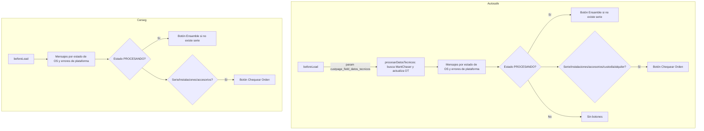
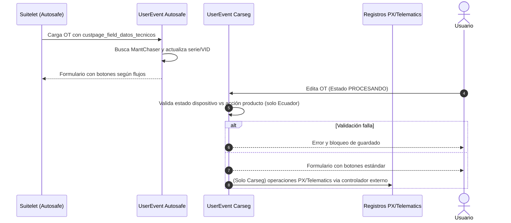

# Comparativo Autosafe vs Carseg

## Resumen
- Ambos entornos comparten los mismos módulos de constantes, controlador y mensajes de error; las diferencias funcionales se concentran en el User Event de Orden de Trabajo y en un controlador adicional de Carseg para integraciones Hunter.
- Autosafe incorpora un flujo automatizado de pre-ensamble para alquiler que consume datos técnicos del Suitelet y completa la Orden de Trabajo antes de cargar la interfaz.
- Carseg mantiene un User Event más conservador (sin pre-ensamble), pero añade validaciones previas al guardado para la subsidiaria de Ecuador y un controlador de integraciones (PX/Telematics) no presente en Autosafe.

## Módulos compartidos
- `constant/TS_CM_Constant.js` es idéntico en ambas subsidiarias; define los mismos estados, parámetros y valores de control (incluidos los estados específicos de Perú y Ecuador).【F:AUTOSAFE/constant/TS_CM_Constant.js†L1-L122】【F:CARSEG/constant/TS_CM_Constant.js†L1-L122】
- `controller/TS_CM_Controller_PE.js` y `controller/TS_CM_Controller.js` contienen la misma lógica de negocio; la diferencia es solo nominal en la referencia del User Event.【F:AUTOSAFE/User_event/TS_UE_Orden_Trabajo_PE.js†L33-L37】【F:CARSEG/User_event/TS_UE_Orden_Trabajo.js†L33-L37】
- `error/TS_CM_ErrorMessages.js` no presenta variaciones entre subsidiarias.【F:AUTOSAFE/error/TS_CM_ErrorMessages.js†L1-L80】【F:CARSEG/error/TS_CM_ErrorMessages.js†L1-L80】

## Diferencias del User Event de Orden de Trabajo
### Autosafe (`User_event/TS_UE_Orden_Trabajo_PE.js`)
- Procesa parámetros `custpage_field_datos_tecnicos` enviados por el Suitelet para pre-ensamblar órdenes de alquiler: busca el MantChaser, carga el detalle del dispositivo (incluido VID) y actualiza la OT antes de mostrar el formulario.【F:AUTOSAFE/User_event/TS_UE_Orden_Trabajo_PE.js†L39-L391】
- Muestra el botón **Chequear Orden** si la OT está en `PROCESANDO/CHEQUEADO` y se cumple alguna condición de serie, instalaciones, accesorios o flujos de custodia/alquiler; añade botones de ensamble (alquiler, custodia, garantía) solo cuando no hay serie asignada y usa el client script específico `_PE`.【F:AUTOSAFE/User_event/TS_UE_Orden_Trabajo_PE.js†L130-L209】
- No implementa validaciones en `beforeSubmit`; el guardado sigue el flujo estándar después de `afterSubmit`.

### Carseg (`User_event/TS_UE_Orden_Trabajo.js`)
- No consume `custpage_field_datos_tecnicos`; el formulario se carga sin pre-ensamble automático.【F:CARSEG/User_event/TS_UE_Orden_Trabajo.js†L39-L137】
- El botón **Chequear Orden** solo depende de tener serie o instalaciones/accesorios; los botones de ensamble se agregan en vista y usan el client script base (`TS_CS_Ensamble_Dispositivo.js`).【F:CARSEG/User_event/TS_UE_Orden_Trabajo.js†L139-L209】
- Incluye validación en `beforeSubmit` para la subsidiaria de Ecuador: en estado `PROCESANDO` verifica que el estado del dispositivo sea compatible con la acción de producto y la configuración de entrega directa; si falla, bloquea el guardado con un error.【F:CARSEG/User_event/TS_UE_Orden_Trabajo.js†L182-L204】

## Controlador de integraciones exclusivo de Carseg
- Carseg dispone de `IntegracionesHunter/HU_TS_ScriptPlataformas_controller.js`, que gestiona envíos a PX/Telematics (operaciones de instalación, desinstalación, renovación, etc.) y registra resultados en `customrecord_ts_regis_impulso_plataforma`. Autosafe no tiene un módulo equivalente.【F:CARSEG/IntegracionesHunter/HU_TS_ScriptPlataformas_controller.js†L1-L72】

## Diagramas
### Flujo de carga de Orden de Trabajo

### Diagrama de secuencia (resumen)

